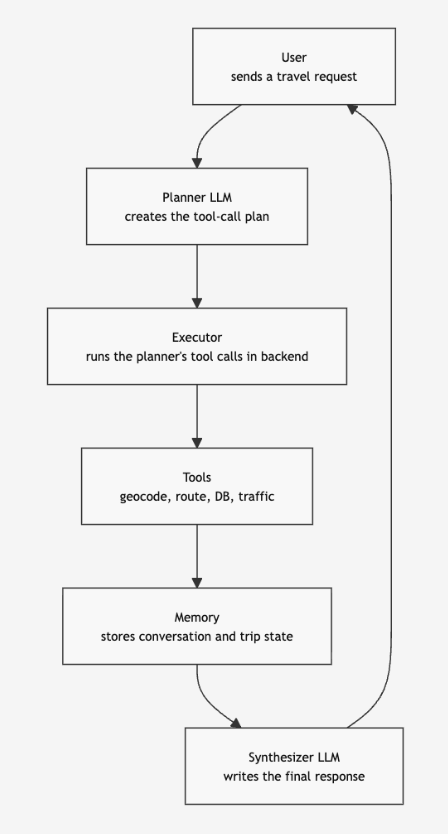
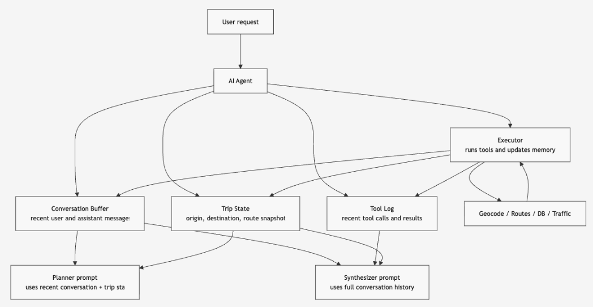

# Al-Osta AI Agent

Personalized trip planning in multi-modal transport networks for Alexandria.


## Project Overview

`Yastaaa` is a mobile application that helps people in Alexandria discover public transportation routes and plan trips. The application relies on an intelligent routing system and the Al-Osta AI Agent to provide a conversational, user-friendly experience.

Instead of exposing users to complex routing logic or raw transit data, the system lets them ask questions naturally while the backend uses deterministic tools and routing logic to produce accurate results.

My contribution was designing and implementing the Al-Osta AI Agent, including the memory system that supports multi-step travel assistance.

## Agent Architecture

The agent follows a three-stage Reasoner-Executor-Synthesizer architecture:

- Reasoner: interprets the user request and breaks it into actionable steps.
- Executor: calls the required tools and services deterministically.
- Synthesizer: turns the tool outputs into a clear final response.

This structure keeps the agent reliable, reduces unnecessary token usage, and makes the workflow easier to control.



### Reasoner

The Reasoner understands the user request and converts it into a sequence of steps. It decides which tools are needed, in what order they should run, and what information must be collected before answering.

### Executor

The Executor runs the plan produced by the Reasoner. It interacts with external tools, databases, and services to gather the required data and perform the needed computations. The Executor uses no LLM tokens during execution; it only passes tool results and the user query to the Synthesizer.

### Core Tools

- `check_traffic`: checks the current traffic status for a street group in Alexandria.
- `db_tools`: finds nearby transit trips around a coordinate using the DB Tools API.
- `geocode_location`: converts a place name in Alexandria into a single latitude/longitude pair.
- `get_routes`: finds multimodal transportation routes between two points using coordinates and routing preferences.

### Synthesizer

The Synthesizer turns the Executor results into a concise, user-friendly final response. It combines retrieved information with conversation context so the answer directly addresses the user’s request.


## Memory Architecture

The memory system is designed to support multi-step travel assistance while keeping the agent efficient, context-aware, and easy to control. Instead of using one general-purpose memory store, the agent separates memory into three specialized layers:

- Conversation memory
- Tool memory
- Trip-state memory

This modular design helps the agent preserve the most relevant information across turns without overwhelming the language model with unnecessary history.

### Main Design

The memory layer is intentionally lightweight:

- ConversationBuffer stores recent dialogue turns between the user and the assistant.
- ToolLog stores which tools were called, which parameters were used, and what they returned.
- TripState stores structured trip data such as origin, destination, mode preference, last route snapshot, and recently seen locations.

### ConversationBuffer

ConversationBuffer stores recent dialogue between the user and the assistant. Its purpose is to preserve short-term context so the agent can understand references such as "that place", "the previous route", or "change the destination". It keeps only the most recent turns to avoid prompt growth and reduce token usage.

### ToolLog

ToolLog records the tools called by the Executor, together with their parameters and outputs. This is useful because the agent’s behavior depends not only on the user’s latest message, but also on what actions have already been taken. If geocoding or routing has already been performed, the agent can reuse that information instead of repeating the same operation.

The system summarizes tool results before storing them, which keeps the log compact while preserving the essential facts needed for later reasoning.

### TripState

TripState holds normalized travel information such as origin, destination, mode preference, recent locations, the last route snapshot, and inferred intent. Unlike the ConversationBuffer, it stores semantic state rather than raw natural language. This makes it useful for route requests, nearby-trip lookups, and traffic queries.

### Workflow

- Before planning, the agent uses the trip-state snapshot, recent conversation, and cached tool outputs to build the Reasoner context.
- During execution, the agent updates memory by logging tool calls and storing newly discovered locations or route details.
- After execution, the Synthesizer uses the conversation history, recent tool log, and current trip snapshot to generate the final response.



## Tech Stack

- LLM client: Gemini
- Reasoner model: `gemini-2.5-flash`
- Synthesizer model: `gemini-2.5-flash-lite`
- Maps services: Google Maps API for traffic and geocoding
- `grok-4-latest` api for evals LLM judje 

## Evaluation

The agent was evaluated using four initial criteria:

| Criterion | Description |
| --- | --- |
| Tool calling | The agent must choose the correct tools before execution. |
| Correct arguments | The agent must pass the right parameters to each tool. |
| Ambiguity handling | The agent must recognize unrelated or unclear requests and ask for clarification. |
| Response quality | The final response should be complete, clear, and useful. |

### Evaluation Scenarios

- For a route request such as "from Manshya to Loran", the agent should first call the geocoding tool and then call the routing tool.
- For a traffic request such as "traffic status in Abu Qir Street", the agent should call the traffic tool.
- For a low-fare request such as "go to Bahri with the lowest fare", the agent should use the cost-related routing options.
- For an unrelated request such as "how to cook molokhia", the agent should respond that the request is unrelated and ask for clarification.

The evaluation dataset contains 30 test cases covering the four categories above. Each test case includes the input, category, and expected behavior.

## Results

Add the final evaluation scores, observations, and any comparison notes here once the experiment results are finalized.

## Repository Structure

```text
Alexandria-Multimodal-Routing-Engine/
├── agent.py
├── llm_client.py
├── main.py
├── ui_app.py
├── requirements.txt
├── README
├── Dokcerfile
├── data/
│   ├── gtfsAlex/
│   └── utils/
├── db_tools/
├── evals/
├── geocoding_api/
├── memory/
├── prompts/
├── routing_api/
├── tools/
└── traffic_updater/
```
